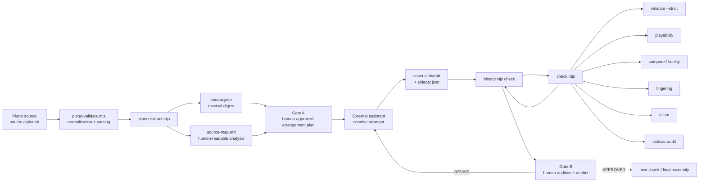
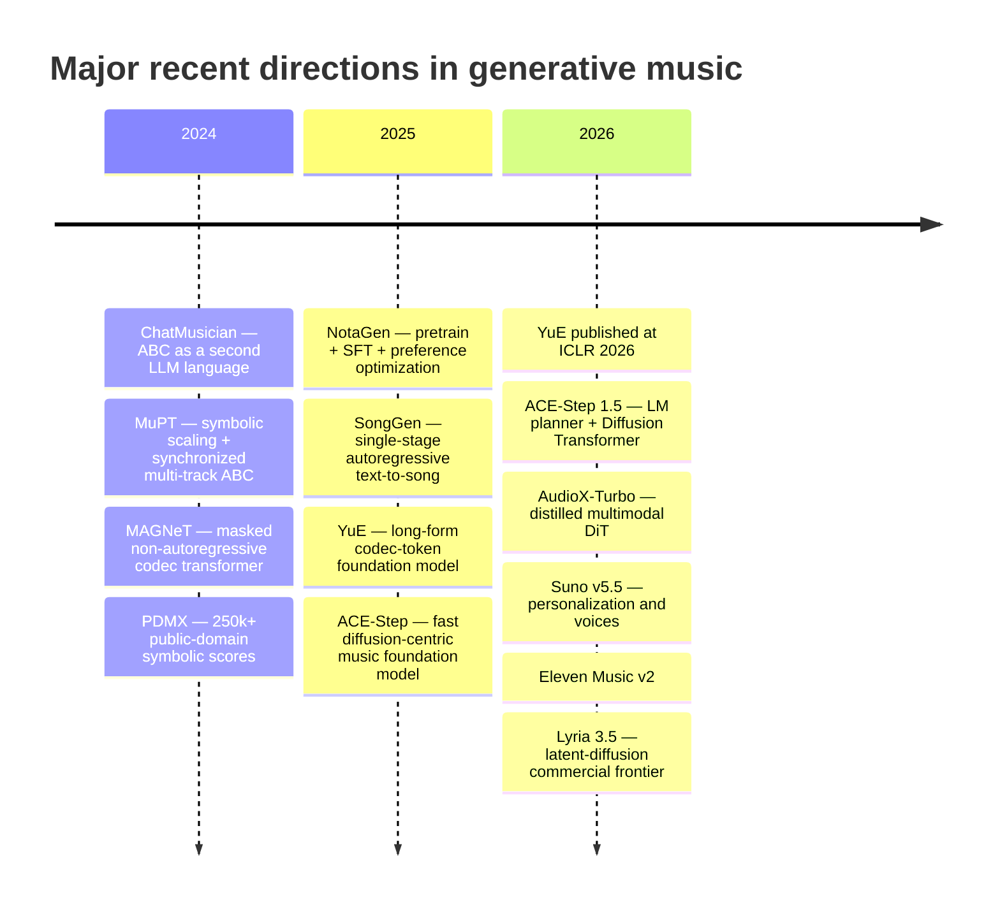
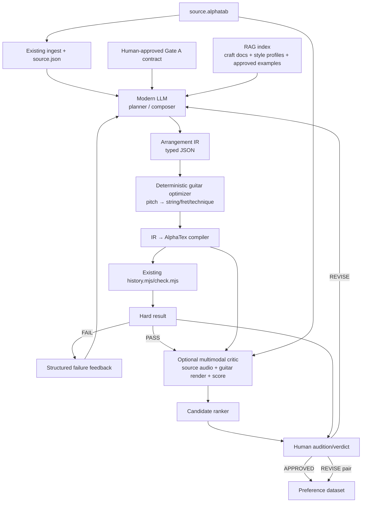

# Deep Research Report: Modernizing `starryark/piano-to-guitar` with Music-Capable Large Language Models

## Executive summary

This audit reaches a somewhat counterintuitive conclusion: **`piano-to-guitar` is not presently a machine-learning or LLM music-generation repository at all.** It is a carefully engineered, deterministic, human-in-the-loop **arrangement toolchain and verification system**. The creative arranger is deliberately external: a generic coding/LLM assistant reads vendor-neutral instructions, proposes an arrangement, writes AlphaTex, and is constrained by deterministic syntax, playability, fidelity, and human-audition gates. The repository itself contains **no neural checkpoint, no model loader/API client, no learned tokenizer, no training loop, and no fine-tuning code**; its sole direct runtime dependency is `@coderline/alphatab`. fileciteturn7file0L2-L2 The canonical agent instructions explicitly describe this as a Node-only, one-parser, one-dependency architecture, and `CLAUDE.md` is only a pointer to vendor-neutral instructions rather than a Claude-specific runtime integration. fileciteturn11file0L2-L2 fileciteturn10file0L2-L2

That is more strength than weakness. The repository already has something that many generative-music systems lack: an explicit definition of what **must** survive an arrangement. `quote` spans preserve melodic skeleton plus harmonic-root motion; `recompose` spans preserve roots while permitting melodic replacement; `free` spans represent declared additions; noisy transcription can be handled by a human-reviewed melody contract. Syntax/bar filling, physical guitar feasibility and those fidelity obligations are separated from soft judgments such as density, contour, fingering, guitar idiom and harmonic color. fileciteturn4file0L2-L2 fileciteturn17file0L2-L2 This makes the existing checker an unusually good **verification layer around an LLM**, rather than something that should be replaced by an LLM.

The principal weakness is therefore the missing layer between deterministic analysis and deterministic verification. Today the most musically consequential step—turning the source digest and an approved plan into guitar-writing decisions—is off-repository and essentially unspecified. Consequently, two people can clone the same commit and run identical gates but cannot reproduce the same creative generation unless they independently know the assistant model/checkpoint, tokenizer, system prompt, sampling parameters, retrieved context and conversation state. The repository versions tab iterations, but not the complete generative provenance needed to reproduce them. The most important modernization is to make that creative layer **explicit, structured and versioned**.

The best technical direction is **not an end-to-end audio model replacing AlphaTex**. For this repository's product—an editable, playable guitar arrangement—current symbolic-music research is much more directly applicable. ChatMusician demonstrated continual pre-training and fine-tuning of a 7B LLaMA-family model directly on ABC using an ordinary text tokenizer; MuPT found ABC especially compatible with LLMs and introduced synchronized multi-track ABC with 8,192-token contexts; NotaGen showed that pre-training, high-quality supervised fine-tuning and preference optimization can improve symbolic musicality. citeturn23search0turn23academia49turn23academia47 Meanwhile, the audio frontier increasingly uses either codec-token autoregressive models, as in YuE and SongGen, or **hybrid planner/diffusion architectures**, most notably ACE-Step 1.5, where an LM writes a detailed song blueprint and a diffusion transformer performs high-fidelity synthesis. citeturn23search1turn24academia0turn24academia1

For `piano-to-guitar`, I therefore recommend a hierarchical system:

**AlphaTex → existing deterministic digest → LLM arrangement planner → typed Arrangement IR → deterministic guitar compiler/fingering optimizer → AlphaTex → existing hard gates → LLM repair loop → human audition.**

Retrieval should supply relevant guitar craft documentation, style profiles and—where rights allow—previously approved/rejected arrangement examples. Fine-tuning should come only after this prompting/RAG baseline has created a usable preference dataset. An optional multimodal stage can compare the source recording with a deterministic guitar render and rank candidates for phrasing, musicality and style, while never becoming the authority for physical playability or score fidelity.

As of September 5, 2026, the broader frontier illustrates why this separation is appropriate. Among open systems, ACE-Step 1.5 combines LM planning and DiT synthesis and reports sub-10-second song generation on an RTX 3090; AudioX-Turbo combines multimodal conditioning with a distilled diffusion transformer and uses only four generation steps; YuE attacks five-minute long-form song coherence with a LLaMA2-derived codec-token approach. citeturn24academia1turn24academia2turn23search1 Commercially, the latest official releases found in this audit include **Suno v5.5** from March 26, 2026, **Eleven Music v2** from May 26, 2026, and **Google Lyria 3.5** from July 29, 2026; Google discloses that Lyria 3.5 uses latent diffusion over temporal audio latents, while Suno and ElevenLabs do not publicly disclose comparable architectural/model-size/training-compute details. citeturn25search4turn25search1turn25search0

Finally, licensing is a blocking governance issue before this repository becomes a reusable ML project. **No root software license is present in the inspected current tree.** Under GitHub's own guidance, absent a license, normal copyright defaults apply; publishing a repository does not itself grant general rights to reproduce, modify and redistribute the code beyond platform-specific rights such as viewing/forking. fileciteturn1file0L2-L2 citeturn27search5 The locked alphaTab dependency is version 1.8.4 under MPL-2.0. fileciteturn18file0L2-L2 The repository also includes vendored code from `abc-to-guitar@ba7e29c` and several song-named AlphaTex artifacts whose redistribution/training provenance is unspecified in the inspected documentation. Those issues should be resolved **before** training a model on repository content or publishing derivative checkpoints. fileciteturn12file0L2-L2

## Repository architecture and code audit

**Audit scope and checkout status.** I attempted an actual shallow clone with:

```bash
git clone --depth 1 https://github.com/starryark/piano-to-guitar /tmp/piano-to-guitar
```

The execution environment could not resolve `github.com`, so the filesystem clone failed before receiving repository objects. I therefore performed the code audit against the connected GitHub repository API: recursive current-main tree, README, package manifests, canonical agent documentation, CI, extraction/analysis code, consolidated checker, gate templates and recent commit metadata. The audited main commit is `b121758d3a343157d1b9d8583d9240c60b7b72b2`, committed August 4, 2026; that commit records the second CI run as green across Ubuntu, macOS and Windows on Node 22 and 24. fileciteturn20file0L3-L6 fileciteturn20file0L38-L41 I did **not** independently execute `npm test` or `npm run smoke` because the failed clone left no local working tree; CI/test conclusions below are therefore repository evidence, not an independently repeated run.

The repository describes its objective as transforming a piano **AlphaTex** score into a playable solo electric-guitar rock arrangement, also in AlphaTex. Crucially, it calls the assistant a “guitarist-arranger, not a transcriber”: the intended operation is recomposition around a protected melodic/harmonic skeleton rather than note-for-note reduction. fileciteturn4file0L2-L2

A useful reconstruction of the current architecture is:



This diagram is a synthesis of the README, `AGENTS.md` and `check.mjs`: `history.mjs check` wraps `check.mjs`; `check.mjs` invokes validator, playability and source comparison as hard-stage machinery and runs fingering/idiom/sidecar analysis as soft channels. fileciteturn11file0L2-L2 fileciteturn13file0L2-L2 fileciteturn14file0L2-L2

| Requested component | What exists in the current repository |
|---|---|
| **Model architecture** | No learned model. The effective "architecture" is deterministic source analysis + an external creative assistant + deterministic gates + human approval. The model behind that external assistant is **unspecified**. fileciteturn4file0L2-L2 |
| **Model checkpoints** | **None in the repository.** No checkpoint path, weights manifest, Hugging Face model identifier or model-download machinery appears in the inspected execution path. `package.json` has one runtime dependency, alphaTab. fileciteturn7file0L2-L2 |
| **LLM provider/API** | **Absent.** `CLAUDE.md` explicitly redirects Claude Code to vendor-neutral `AGENTS.md`/workflow documents rather than implementing a Claude API client. fileciteturn10file0L2-L2 |
| **Prompts/instructions** | The functional prompts are repository prose: principally `AGENTS.md`, `docs/workflow.md`, `docs/gate-templates.md`, style/reference documents and the thin `.claude` skill. Gate A asks for key/transposition, tuning, physical guitar, tempo, gain, section mapping, right-hand identity, techniques and deliberate losses; Gate B specifies how a chunk and fidelity report are presented for judgment. fileciteturn17file0L2-L2 |
| **Tokenization** | No ML tokenizer. AlphaTex is parsed semantically by `@coderline/alphatab`; the analyzer works on parsed notes/events. Any tokenizer used by an external LLM to consume AlphaTex or prompt text is **unspecified**. fileciteturn16file0L2-L2 |
| **Source preprocessing** | `piano-validate.mjs`/`piano-source.mjs` normalize a known pitched-rest export defect; `piano-extract.mjs` produces `source.json` and `source-map.md`; `analysis.mjs` derives register-based melody/bass, tie-coalesced events, melodic skeletons, harmony, sections, repeats and harmonic loops. fileciteturn11file0L2-L2 fileciteturn15file0L2-L2 |
| **Noisy-transcription preprocessing** | `source-profile` and `foreground` identify ambiguous perceptual foreground; a human-reviewed `melody-contract.json` can replace heuristic melody extraction as the hard obligation. fileciteturn12file0L2-L2 |
| **Training scripts** | **None.** The repository does not train, fine-tune or pre-train any neural model. |
| **Evaluation scripts** | Extensive. The npm test command currently chains 24 unit/integration/regression/scale/history suites. The production gate covers validation, playability, fidelity, fingering, idiom and sidecar analysis, plus smoke/performance commands. fileciteturn7file0L2-L2 |
| **Dependency graph** | One direct dependency, `@coderline/alphatab`; `package-lock.json` pins it to 1.8.4. No Python and no second music parser are part of the runtime. fileciteturn7file0L2-L2 fileciteturn18file0L2-L2 |
| **CI** | GitHub Actions executes `npm ci`, full tests, smoke, a cross-process determinism test and a clean-working-tree assertion on Ubuntu/macOS/Windows × Node 22/24. fileciteturn19file0L2-L2 |
| **Repository license** | No root `LICENSE` is visible in the inspected main tree, and no license declaration was found by repository code search. Rights for the repository as a whole are therefore **not explicitly granted in the inspected codebase**. fileciteturn1file0L2-L2 |
| **Dependency license** | Locked alphaTab 1.8.4 declares MPL-2.0. fileciteturn18file0L2-L2 |
| **Vendored-code license** | The code states that gate tools were vendored from `abc-to-guitar@ba7e29c`, but the inspected `piano-to-guitar` documentation does not itself establish the legal license of that snapshot. That is **unspecified and requires an upstream provenance check** before relicensing/distribution. fileciteturn12file0L2-L2 |

The preprocessing layer is unusually substantive. `analysis.mjs` is a JavaScript port of musical analysis previously implemented in Python, with AlphaTex/alphaTab replacing MusicXML ingestion. It deliberately infers melody and bass from sounding register rather than staff/voice labels, calculates structural melody events from metrical strength, duration and contour, and applies deterministic chord templates. It also deliberately anchors inferred harmonic root to the sounding bass for the repertoire the repository was designed around. fileciteturn16file0L2-L2

The source digest is therefore already close to a useful **LLM intermediate representation**. The documented per-bar surface includes meter, tempo, raw voices, melody/bass selection, `melody[]`, `melodySkeleton[]`, bass, harmony, half-bar harmony spans and perceptual-foreground evidence, while tie continuations are separated from real attacks. fileciteturn12file0L2-L2 This is a better prompt input than dumping raw notation text into a general model.

The gate design is also unusually disciplined. `check.mjs` runs sub-tools as child processes and interprets operational failure separately from musical hard failure. A soft analyzer that crashes is not silently mapped to “zero warnings”; it causes an operational error. The hard verdict is constructed **before** soft advisories, so a soft stylistic rule cannot accidentally become a hard constraint through aggregation. fileciteturn14file0L2-L2

Several strengths should be preserved during modernization:

**Hard versus soft semantics are explicit.** This is essential for generative systems. A technically easier fingering is not automatically a better musical fingering, and the repository already encodes that distinction; fingering is advisory and never silently rewrites the arrangement. fileciteturn12file0L2-L2

**The source-to-cover relationship is first-class.** A sidecar explicitly states whether each output region is `quote`, `recompose`, `free`, `contract` or `contract-recompose`; this is far superior to trying to infer after generation what an LLM intended. fileciteturn17file0L2-L2

**Anti-vacuity thinking is built in.** The authors recognized that `0/0` can trivially satisfy a coverage check and now explicitly require nonzero gate-critical data. `piano-extract` refuses a completely vacuous digest. fileciteturn15file0L2-L2 This mindset is particularly important once a learned generator is optimizing against gate scores.

**Testing is stronger than average for a music prototype.** The current test command spans low-level musical analysis, track roles, contracts, styles, scenarios, regression locking and a scale test, and CI explicitly checks cross-process determinism and that analysis does not mutate the working tree. fileciteturn7file0L2-L2 fileciteturn19file0L2-L2

The largest limitations are architectural rather than implementation bugs.

First, **creative-generation reproducibility is effectively absent**. The repository can reproduce the judgment of a given tab, but not the tab's generation. There is no `model_id`, checkpoint revision, tokenizer revision, system-prompt hash, sampling configuration, seed, retrieved-context manifest or model output trace. The human-history mechanism records arrangement revisions, not the full model provenance that generated those revisions. This should be considered the largest gap relative to modern ML experimentation.

Second, the creative assistant writes a serialization format directly. AlphaTex is appropriate as the final source of truth, but requiring a probabilistic model to generate syntactically and physically valid AlphaTex conflates **composition** with **serialization and fretboard assignment**. A typed musical intermediate representation followed by deterministic compilation would isolate these concerns.

Third, hard-gate pass rate is a potentially gameable objective. `free` spans intentionally have no source-fidelity obligation and `recompose` removes the melodic-skeleton obligation. fileciteturn17file0L2-L2 A learned system allowed to choose its own modes could improve “pass rate” merely by declaring difficult spans `free` or `recompose`. **Gate-A mode assignments must therefore be human-approved and immutable to the generator**, or the objective becomes reward-hackable.

Fourth, the harmony and foreground systems are deterministic heuristics rather than universally valid musical-analysis models. The repository itself recognizes noisy automatic transcription as a case where the nominal `melodySkeleton` is not perceptual truth and introduces a human-reviewed foreground contract accordingly. fileciteturn12file0L2-L2 That is the right failure mode, but an LLM upgrade should not assume the digest is oracle-quality.

Fifth, there are minor documentation/reproducibility inconsistencies worth cleaning up before ML work. For example, the canonical documentation describes the problematic `Canon Rock 1` declaration as sounding in D while `analysis.mjs`'s header comment says that the same declared C key sounds in E. fileciteturn11file0L2-L2 fileciteturn16file0L2-L2 Even if the actual analyzer/test establishes the correct answer, conflicting prose is hazardous when those documents double as LLM instructions.

Sixth, `package.json` contains no Node `engines` constraint even though CI specifically validates Node 22 and 24. fileciteturn7file0L2-L2 fileciteturn19file0L2-L2 Adding an engines declaration or checked-in runtime-version file would make the tested environment more obvious locally.

Finally, there is a documentation/repository-content tension relevant to licensing. The README says song project folders are local/gitignored because sources and covers may be copyrighted and says no example arrangement is shipped, yet the current root tree contains several song-named directories and `.alphatab` files outside `projects/`. fileciteturn4file0L2-L2 fileciteturn2file0L2-L2 Their copyright and training-use provenance is **unspecified** in the inspected documentation and should be resolved before treating the repository as a machine-learning corpus.

## State of the art in LLM-based music composition

There is no scientifically defensible single “best music LLM” in 2026 because the field now comprises substantially different tasks: symbolic composition, lyrics-to-song generation, text-to-audio, multimodal audio editing, accompaniment generation and long-form song synthesis use different outputs and incompatible evaluation protocols. The important state-of-the-art development of the past three years is instead a split into **two complementary model families**, with hybrids increasingly bridging them.

The **symbolic LLM frontier** treats notation as language. ChatMusician continually pre-trains and fine-tunes LLaMA2 on ABC notation using the model's normal text tokenizer, explicitly showing that a special audio tokenizer is not necessary when the musical representation itself is textual. It conditions on text, chords, melodies, motifs and musical form and releases MusicPiles/MusicTheoryBench alongside the model. citeturn23search0 MuPT reaches a similar conclusion from a scaling perspective: its authors report that ABC is a better fit for LLM-style modeling than MIDI token sequences in their experiments and introduce **Synchronized Multi-Track ABC** to keep simultaneous parts metrically aligned; its 8,192-token context covers about 90% of its symbolic training samples. citeturn23academia49

NotaGen extends that trajectory by importing almost the complete contemporary LLM training stack into symbolic composition: broad pre-training on roughly 1.6 million scores, high-quality supervised fine-tuning on about 9,000 classical compositions with structured period/composer/instrumentation conditioning, then CLaMP-DPO preference optimization without requiring manually labeled human rewards. Its paper reports improvements in blind subjective A/B comparisons. citeturn23academia47 The important lesson for `piano-to-guitar` is not “use NotaGen directly”; it is that **symbolic generation benefits from the same progression that transformed textual LLMs: broad prior → domain SFT → preference optimization**.

The **audio-token LLM frontier** instead models discrete codec representations. YuE is the clearest open long-form example: it is based on the LLaMA2 architecture, scales training to trillions of tokens and addresses up-to-five-minute generation with track-decoupled next-token prediction, structural progressive conditioning and a multi-phase training recipe. Its authors report competitive results against proprietary systems and strong representation performance on MARBLE. citeturn23search1turn23academia50 SongGen takes a single-stage autoregressive approach while supporting lyric/text conditioning, optional three-second voice references, and either mixed audio output or separate vocal/accompaniment tracks. citeturn24academia0

A third branch is increasingly important: **non-autoregressive and diffusion/transformer generation**. MAGNeT masks and iteratively predicts several streams of EnCodec tokens with one non-autoregressive transformer; its paper reports comparable quality to evaluated baselines at about seven times the inference speed of its autoregressive baseline. Meta's released music variants are 300M and 1.5B parameters, generate 10- or 30-second 32-kHz samples, and were trained on about 16,000 hours of licensed music. citeturn27academia24turn27search0

ACE-Step made the hybrid case explicit in 2025: its first release paired diffusion generation with compressed latent representations and transformer/representation-learning components, reporting up to four minutes in about 20 seconds on an A100. citeturn24academia3 ACE-Step 1.5 in 2026 goes further and uses an **LM as an explicit planner**: the LM expands the user's request into metadata, captions, lyrics and a detailed song blueprint; a Diffusion Transformer synthesizes the result. The paper reports support up to ten-minute compositions, sub-two-second full-song generation on A100 hardware, sub-ten-second generation on an RTX 3090, and LoRA personalization from a few songs. Those are author-reported results rather than independently standardized benchmark results, but the architecture itself is strategically important. citeturn24academia1

AudioX-Turbo represents another 2026 frontier: instead of a text-only control channel, its teacher is a multimodal Diffusion Transformer that fuses text, video and audio conditions. The student is distilled using distribution-matching techniques adapted to flow matching plus a diffusion discriminator. Its IF-caps-Pro corpus contains about 9.2 million examples; the paper reports four-step synthesis with roughly 25× fewer function evaluations than multi-step baselines. citeturn24academia2 This is a strong signal that future music tooling will increasingly accept **multimodal creative evidence**, not merely prose prompts.

The trajectory can be summarized as follows:



The dates and model descriptions above are grounded in their papers or official release/model pages. citeturn23search0turn23academia49turn23academia47turn23search1turn24academia1turn24academia2turn25search4turn25search1turn25search0

For `piano-to-guitar`, the implications differ by layer.

**Symbolic representations should remain the authoritative compositional representation.** They preserve exact pitch, rhythm, polyphony, source correspondence and physical-instrument constraints. They are diffable, inspectable and compatible with the repository's hard gates. The recent success of ChatMusician and MuPT makes it reasonable to treat text notation as a first-class LLM language instead of prematurely moving to audio. citeturn23search0turn23academia49

**Codec-token/audio models should be downstream, not authoritative.** They are much better at timbre, phrasing, expressive vocals, amp-like texture and perceptual realism, but their outputs do not naturally encode an auditable string/fret assignment or guarantee that a human guitarist can reproduce the performance. YuE and SongGen illustrate the strengths of audio-token autoregression; MAGNeT, ACE-Step and AudioX illustrate the speed and editing benefits of parallel/diffusion-like approaches. citeturn23search1turn24academia0turn27academia24turn24academia1turn24academia2

**Hybrid architecture is the emerging practical sweet spot.** ACE-Step 1.5's explicit separation of language-model planning from high-fidelity diffusion synthesis is particularly analogous to what this repository needs: here the LM should plan the guitar arrangement while a deterministic music compiler—not a DiT—realizes the score; an audio model can then render or critique it. citeturn24academia1

The commercial frontier reinforces these observations. As of September 5, 2026:

Suno's latest official model release found in this audit is **v5.5**, released March 26, 2026. Suno describes richer arrangements, sharper vocals and more dynamic sound and adds custom model variants trained from at least six user-supplied tracks, user-voice conditioning and taste personalization. Its public release material does **not** disclose model architecture, parameter count, training dataset size or training compute, so those fields should be recorded as **unspecified** rather than inferred. citeturn25search4turn25search13

ElevenLabs released **Music v2** on May 26, 2026 and most recently updated its release page August 27, 2026. It reports better vocals, instrumentation, arrangement and multilingual behavior and deploys the model through ElevenMusic, ElevenAPI and ElevenCreative. Comparable architecture, parameter count and training-compute disclosure is **unspecified** in the official release material reviewed here. citeturn25search1

Google DeepMind published the **Lyria 3.5** model card July 29, 2026. Unlike most commercial competitors, it discloses the high-level architecture: latent diffusion over temporal audio latents. Training used audio captioned at multiple levels of detail, filtering/deduplication, Google TPUs, JAX and ML Pathways; dataset scale, parameter count, TPU count and total training compute remain **unspecified**. Google evaluates it using both automated and human methods across musical/aesthetic quality, vocals, audio fidelity and prompt adherence and reports improvement over Lyria 2. citeturn25search0 Its product page supports tracks up to three minutes and image-to-music interaction, illustrating the commercial move toward multimodal composition interfaces. citeturn25search8

Udio's technical architecture remains undisclosed in the official materials reviewed here. Its public product state is also affected by licensing partnerships: a February 17, 2026 official help article states that downloading generated audio, video and stems had been disabled as part of its Universal Music Group partnership transition. citeturn25search3 This is a reminder that model capability alone does not determine the practical value of a music-generation integration; licensing and product-export rights matter.

## Comparative landscape

The table below deliberately uses **“unspecified”** whenever a model's authors or official project materials do not disclose the requested detail. “Quality evidence” is not a universal leaderboard: papers use different source data, durations, listener protocols and objective metrics, so raw claims cannot responsibly be ranked as though they came from one benchmark.

| System | Representation and I/O | Model scale | Training data | Disclosed training compute | Evaluation and sample-quality evidence | Relevance to `piano-to-guitar` |
|---|---|---:|---|---|---|---|
| **ChatMusician, 2024** | Text + ABC → ABC/text; chords, melody, motifs and form can condition composition. Uses the ordinary LLM text tokenizer rather than a music/audio tokenizer. citeturn23search0 | LLaMA2 **7B** | MusicPile/MusicPiles, reported as roughly **4–5B tokens** across paper/release versions; MusicTheoryBench also released. citeturn23academia48turn23search0 | Paper reports continual pre-training on **16×80GB A800** GPUs and SFT on **8×32GB V100** GPUs; full energy/FLOP budget unspecified. | MusicTheoryBench + MMLU + generation/human comparison; authors report stronger specialized music reasoning/generation than several general LLM baselines. citeturn23search0 | **Very high.** Strong evidence that text-compatible notation can be integrated directly into an LLM. |
| **MuPT, 2024** | ABC and **SMT-ABC** multi-track symbolic sequences → symbolic music. citeturn23academia49 | Released study spans roughly **110M–1.3B** | About **7M symbolic pieces** in project training corpus; 8,192-token context covers about 90% of samples. | Exact accelerator model, GPU-hours and energy: **unspecified** in the primary material reviewed. | Scaling-law/language-model loss studies plus generation analysis; central reported result is improved LLM compatibility of ABC and coherent multitrack representation. citeturn23academia49 | **Very high.** SMT-ABC is a useful design reference for multi-guitar/track synchronization. |
| **NotaGen, 2025** | Structured symbolic sheet music, conditioned on period/composer/instrumentation prompts. | Study variants reach approximately **516M** parameters | **1.6M** pieces for pre-training; about **9K** curated classical works for fine-tuning. citeturn23academia47 | Full original training cluster/runtime: **unspecified** in the cited primary paper abstract/release summary. | CLaMP-DPO preference optimization; authors report subjective A/B improvements and greater musicality versus baselines. citeturn23academia47 | **High.** Most relevant evidence for adding SFT + preference learning after symbolic pretraining. |
| **YuE, 2025–2026** | Lyrics/text/reference context → long-form audio tokens/audio; track-decoupled prediction and structural progressive conditioning. citeturn23search1 | LLaMA2-derived multi-stage foundation family; complete aggregate parameter total: **unspecified here** | Training scales to **trillions of tokens**; underlying audio-corpus size/composition is not fully disclosed in the primary overview. citeturn23search1 | Exact GPU count/hours: **unspecified** | Up to **5 min**; musicality/vocal agility evaluation plus MARBLE representation tests; authors report matching or exceeding some proprietary systems. citeturn23search1 | **Medium for tab, high for rendering/reference-audio reasoning.** Long-form structural techniques are transferable. |
| **SongGen, 2025** | Lyrics + text description + optional **3-s voice clip** → either mixed song audio or separate vocal/accompaniment tracks. citeturn24academia0 | Released model approximately **1.3B** | Official project reports about **2,000 h** of training audio; automated preprocessing/QC is part of the release. | Exact training hardware/runtime: **unspecified** | Paper provides objective/subjective song-generation evaluation and public samples; direct dual-track generation is a notable controllability feature. citeturn24academia0 | **Medium.** Useful reference for explicitly separating musical roles/tracks. |
| **MAGNeT, 2024** | Text → EnCodec tokens → 32-kHz audio; masked **non-autoregressive transformer** with iterative decoding. citeturn27search0 | **300M / 1.5B** released music checkpoints; code also supports a 3.3B scale. citeturn27search0 | About **16K h licensed music**, including internal licensed tracks, Shutterstock and Pond5. citeturn27search0 | Released training config uses **32 GPUs** with batch 192; exact GPU type/training duration for final checkpoints is unspecified. citeturn27search8 | Authors report quality comparable with evaluated baselines and about **7×** faster inference than an autoregressive baseline. citeturn27academia24 | **Medium/low for symbolic composition; high as an architectural comparison for fast audio audition.** |
| **ACE-Step 1.5, 2026** | User request → **LM-generated blueprint/metadata/lyrics/captions → DiT audio**; also cover/edit/vocal↔BGM operations. citeturn24academia1 | Multiple LM/DiT variants; one unique aggregate parameter count is not meaningful and is **unspecified in the paper abstract** | Detailed corpus size: **unspecified** in cited paper summary | Full training compute: **unspecified** | Authors report up to **10-min** composition, under 2 s/full song on A100 and under 10 s on RTX 3090, plus strong benchmark results; claims are project-reported. citeturn24academia1 | **Very high architectural relevance.** Planner→renderer separation is an excellent analogue for planner→symbolic compiler. |
| **AudioX-Turbo, 2026** | **Text + video + audio** conditions → audio/music through multimodal DiT teacher and distilled few-step student. citeturn24academia2 | Parameter count: **unspecified** in cited primary abstract | **IF-caps-Pro ≈9.2M samples** | Exact accelerator count/GPU-hours: **unspecified** | Four sampling steps; paper reports especially strong text-to-audio/music results and ≈**25× fewer NFE** than multi-step baselines. citeturn24academia2 | **High for future multimodal audition/criticism**, low as the tab source of truth. |
| **Lyria 3.5, 2026** | Official model card: **text → music audio + lyrics**; product also exposes image-conditioned composition. citeturn25search0turn25search8 | **Unspecified** | Captioned audio with deduplication, safety and quality filtering; scale **unspecified**. citeturn25search0 | Google TPUs, JAX and ML Pathways; TPU count/runtime **unspecified**. citeturn25search0 | Human + automated evaluation across musical aesthetics, vocals, fidelity and prompt adherence; Google reports significant fidelity/adherence improvement over Lyria 2. citeturn25search0 | **High as a commercial multimodal/audio quality reference; low for exact guitar-tab control.** |

Several patterns emerge more reliably than any nominal leaderboard.

**Representation determines controllability.** ABC-native systems can expose notes, voices, bars and form directly to the generator and validator, whereas codec/latent systems optimize perceptual audio. ChatMusician and MuPT are therefore much closer to this repository's core problem than a commercial song generator, even though the latter can sound much more realistic. citeturn23search0turn23academia49

**Parameter count is not a reliable measure of music quality.** NotaGen's contribution is post-training quality rather than enormous scale; MAGNeT trades autoregressive flexibility for parallel decoding; ACE-Step 1.5 splits planning and synthesis rather than forcing a single transformer to perform both. citeturn23academia47turn27academia24turn24academia1

**Long-form structure remains a distinct problem.** YuE explicitly introduces structural progressive conditioning to prevent long-form degradation; ACE-Step 1.5 delegates global structure to an LM-produced blueprint. citeturn23search1turn24academia1 This supports keeping `piano-to-guitar`'s existing Gate-A section/form plan rather than asking a model to generate an entire cover from an undifferentiated prompt.

**Preference optimization is becoming normal, but the reward source matters.** NotaGen uses CLaMP-DPO to avoid expensive manual labels, whereas `piano-to-guitar` already has something more directly useful: a human declares each chunk `APPROVED` or `REVISE` with a reason. fileciteturn17file0L2-L2 Those judgments can eventually become exceptionally task-specific preference data—provided the underlying music is rights-cleared for training.

**Audio-model benchmark numbers should not be imported into a symbolic-tab evaluation.** An improvement in audio fidelity, FAD-like metrics or lyric alignment does not imply that the system chooses playable guitar positions, preserves required melody events or makes a satisfying solo-guitar reduction. The repo needs a separate arrangement benchmark.

## Recommended LLM architecture and integration

The central architectural recommendation is to **preserve all deterministic source analysis and all hard gates, but replace the unspecified free-form assistant with a versioned generation subsystem**.

The target design is:



The most important addition is the **Arrangement IR**. The model should ideally stop producing raw AlphaTex as its primary act. Instead, it should output a machine-validated structure such as:

```json
{
  "schemaVersion": "1.0",
  "section": "theme-a",
  "tabBars": [9, 16],
  "sourceBars": [1, 4],
  "mode": "quote",
  "guitar": {
    "tuning": ["E2", "A2", "D3", "G3", "B3", "E4"],
    "maxFret": 22,
    "preferredPosition": [5, 12]
  },
  "harmonyPlan": [
    {
      "bar": 9,
      "root": "D",
      "texture": "pedal-riff"
    }
  ],
  "events": [
    {
      "bar": 9,
      "beat": 0,
      "durationBeats": 0.5,
      "midi": 74,
      "role": "protected-melody",
      "techniques": ["pick"]
    }
  ],
  "deliberateLosses": [
    "inner piano third omitted under high gain"
  ],
  "additions": [
    "pickup slide into protected melody"
  ]
}
```

The model decides musical intent—rhythm, pitch, reduction, doubling, techniques, motif variation and texture—but the compiler/optimizer assigns string/fret combinations subject to the guitar's actual geometry. That creates a clean separation:

\[
\text{musical decision} \neq \text{fretboard realization} \neq \text{serialization}.
\]

A dynamic-programming fretboard optimizer can enumerate legal positions for each pitch/chord, reject impossible simultaneous attacks using the existing playability rules, and minimize a weighted transition cost:

\[
C = \lambda_1 \Delta\text{hand-position}
  + \lambda_2 \text{string-leap}
  + \lambda_3 \text{fret-span}
  + \lambda_4 \text{technique difficulty}
  + \lambda_5 \text{tone-position penalty}.
\]

Importantly, the repository already recognizes that the cheapest fingering is not automatically the musically best one. fileciteturn12file0L2-L2 The optimizer should therefore accept **soft constraints from the LLM**, such as “keep melody on B string for vocal timbre” or “prefer open D pedal,” while hard geometry remains deterministic.

A first implementation can still permit raw AlphaTex generation for comparison, but an experiment should measure:

\[
\text{raw AlphaTex LLM}
\quad\text{vs}\quad
\text{LLM IR} \rightarrow \text{compiler}.
\]

I would expect the latter to substantially reduce syntax errors and impossible fingerings because those error classes are removed from the model's action space; that expectation is an engineering hypothesis to test, not a measured result.

**Prompting versus fine-tuning.** Start with prompting. A capable contemporary LLM should receive only the relevant source digest bars, the immutable Gate-A contract, exact output schema and a small retrieved set of craft rules. This gives a cheap baseline and exposes whether the bottleneck is musical prior or software integration.

The current enormous `AGENTS.md` should not simply be copied wholesale into every chunk prompt. Instead, construct context hierarchically:

```text
stable system policy
  ├── arranger doctrine
  ├── hard/soft distinction
  └── never change approved Gate-A parameters

current project context
  ├── instrument/tuning
  ├── style/gain
  ├── form and immutable sidecar modes
  └── user preferences

current chunk
  ├── relevant source.json bars
  ├── foreground/melody contract
  ├── preceding accepted motif
  └── next-section boundary

retrieved craft evidence
  ├── only techniques relevant to this texture
  └── 1–3 rights-cleared approved examples
```

This keeps the model's attention focused and makes prompt provenance auditable.

**RAG should precede fine-tuning.** The repo already contains a sizable craft library. Index `reference/`, style profiles, the relevant advisory documentation and human-approved project history by musical metadata: style, section role, harmonic rhythm, fretboard register, technique, difficulty, source texture and verdict. Retrieval should happen at chunk/phrase granularity, not on arbitrary text fragments. A “hard-rock chorus over two-chords-per-bar, high gain, melodic quote, position 7–12” query should return close craft examples rather than generic guitar prose.

Do **not** indiscriminately index copyrighted commercial tabs or external songs. A retrieval system can reproduce source text in its context even when no model fine-tuning occurs; the same rights-cleared-corpus policy should therefore apply to RAG.

Fine-tuning becomes justified after the system accumulates enough task-specific behavior that prompting is demonstrably the bottleneck. A reasonable progression is:

\[
\text{prompt}
\rightarrow
\text{prompt + gate repair}
\rightarrow
\text{RAG}
\rightarrow
\text{LoRA/SFT}
\rightarrow
\text{preference optimization}
\rightarrow
\text{music continual pre-training only if necessary}.
\]

This ordering is supported directionally by symbolic research: ChatMusician demonstrates music-specific continual pre-training/SFT, while NotaGen demonstrates a subsequent preference stage. citeturn23search0turn23academia47

For SFT, each training example should look more like:

```text
INPUT:
  source digest + immutable plan + retrieval context

TARGET:
  approved Arrangement IR
```

rather than raw `source.alphatab → cover.alphatab`. This trains the model to learn **arranging decisions** rather than memorizing parser syntax.

Preference data can be even more valuable. Given revision history:

```text
source + plan
candidate A: failed/rejected arrangement
candidate B: human-approved replacement
reason: "melody lost under repeated low power chords"
```

one obtains a task-specific preference pair:

\[
P(B \succ A\mid \text{source, plan, reason}).
\]

That can drive DPO-like post-training or a small ranking model. Unlike an automatic musicality reward, the label is directly aligned with this repository's product philosophy.

**Music-specific tokenization.** For a prompted general LLM, retain text/JSON/AlphaTex and let the external model's normal tokenizer handle it. ChatMusician provides evidence that text-compatible musical notation can work well without a separate multimodal tokenizer. citeturn23search0

For a dedicated symbolic model, however, benchmark at least three representations:

| Representation | Advantages here | Weaknesses |
|---|---|---|
| **ABC / SMT-ABC** | Empirically compatible with LLMs; text-native; multitrack synchronization studied by MuPT. citeturn23academia49 | Requires AlphaTex↔ABC conversion during training/inference unless only used for pretraining. |
| **AlphaTex** | Exact repository-native format; no conversion at production boundary. | Almost no large-scale pretraining corpus or tokenizer literature compared with ABC/MIDI. |
| **REMI+/MMM-style events** | Explicit bar/position/pitch/program structure; excellent for multitrack modeling and infilling. MidiTok supports MIDI and ABC plus REMI, REMI+, CPWord, Octuple, MuMIDI, MMM and learned BPE/Unigram/WordPiece vocabularies. citeturn26search0turn26search2 | Adds a Python-side preprocessing ecosystem and a non-native production representation. |

My recommended compromise is **ABC or REMI-like tokens for large-scale musical pretraining, Arrangement IR for task fine-tuning, and AlphaTex only as the compiled final artifact**.

MidiTok is useful for research preprocessing even though the production repository intentionally avoids Python. It can be kept in an isolated offline `training/` environment that emits versioned JSON/Arrow datasets; the Node runtime need never import it. The current MidiTok project supports ABC input, multiple canonical symbolic tokenizers, dataset filtering, sequence chunking, augmentation and trained BPE/Unigram/WordPiece tokenizers. citeturn26search0turn26search1

**Multimodal models should be critics and evidence readers first.** A multimodal model can consume the original piano/reference audio, a rendered guitar version, the score/digest and possibly an image of the notation. Its useful tasks are perceptual:

- Is the melodic foreground still perceptually salient?
- Does the cover phrase where the source phrases?
- Is a climactic section actually more intense than its predecessor?
- Does the guitar arrangement sound idiomatic rather than like a mechanically reduced piano?
- Is the requested style/gain language audible in the render?

Those are precisely the dimensions the deterministic score checker cannot fully evaluate. AudioX-Turbo demonstrates current multimodal conditioning across text/video/audio, and Lyria's consumer interface demonstrates image-conditioned music generation. citeturn24academia2turn25search8 But the multimodal critic should return a **soft score or ranking only**. It must never overrule the parser, playability checker or explicit source contract.

For rendering, I would initially prefer a deterministic guitar sampler/amp-simulation path from MIDI so an A/B test reflects the score rather than a second generative model's creative changes. A generative audio model can later be offered as an optional “production preview.” Otherwise, a beautiful audio renderer can mask a weak or physically impossible tab.

A model-neutral Node integration can look like this:

```js
// tools/llm-arrange.mjs
// Pseudocode: the client implements whatever modern LLM provider is selected.

import fs from 'node:fs';
import { spawnSync } from 'node:child_process';

export async function arrangeChunk({
  llm,
  modelId,
  sourceDigest,
  gateAPlan,
  sidecarEntry,
  retrievedContext,
  priorApprovedIR,
  outputPath,
  maxRepairs = 4,
}) {
  // The sidecar mode comes from the APPROVED plan.
  // The model may not weaken quote -> recompose/free.
  const immutableContract = {
    tabBars: sidecarEntry.tabBars,
    sourceBars: sidecarEntry.sourceBars,
    mode: sidecarEntry.mode,
    transpose: gateAPlan.transpose,
    tuning: gateAPlan.tuning,
    maxFret: gateAPlan.maxFret,
    style: gateAPlan.style,
    gain: gateAPlan.gain,
  };

  let gateFeedback = null;

  for (let attempt = 0; attempt <= maxRepairs; attempt += 1) {
    const relevantBars = selectSourceBars(
      sourceDigest,
      sidecarEntry.sourceBars
    );

    const result = await llm.generate({
      model: modelId,
      system: [
        "You are a guitarist-arranger.",
        "Preserve the immutable arrangement contract.",
        "Return ArrangementIR JSON only.",
        "Do not decide whether a span is free, quote, or recompose.",
        "Optimize musical intent; a deterministic compiler assigns legal frets."
      ].join("\n"),
      input: {
        contract: immutableContract,
        source: relevantBars,
        priorApprovedIR,
        retrievedContext,
        previousGateFailure: gateFeedback
      },
      responseSchema: ARRANGEMENT_IR_SCHEMA
    });

    const ir = validateArrangementIR(result);
    const alphatex = compileArrangementIR(ir, immutableContract);

    fs.writeFileSync(outputPath, alphatex, 'utf8');

    const gate = spawnSync(
      process.execPath,
      [
        'tools/check.mjs',
        outputPath,
        '--bars', rangeString(sidecarEntry.tabBars),
        '--map', gateAPlan.sidecarPath,
        '--style', gateAPlan.style,
        '--gain', gateAPlan.gain,
        '--transpose', String(gateAPlan.transpose),
        '--json'
      ],
      { encoding: 'utf8' }
    );

    if (gate.status === 0) {
      return {
        ir,
        alphatex,
        gate: JSON.parse(gate.stdout),
        provenance: {
          modelId,
          attempt,
          promptVersion: PROMPT_VERSION,
          irSchemaVersion: ARRANGEMENT_IR_SCHEMA.version,
          retrievalIds: retrievedContext.map(x => x.id)
        }
      };
    }

    if (gate.status === 2) {
      throw new Error(`Gate could not run: ${gate.stderr || gate.stdout}`);
    }

    // Feed facts, not prose interpretations, back to the model.
    gateFeedback = JSON.parse(gate.stdout);
  }

  throw new Error(`No hard-valid candidate after ${maxRepairs + 1} attempts`);
}
```

Production provenance should additionally log at least:

```json
{
  "modelProvider": "unspecified-provider",
  "modelId": "exact-checkpoint-or-api-version",
  "modelRevision": "immutable-revision-if-available",
  "tokenizerRevision": "exact-tokenizer-revision-if-applicable",
  "promptVersion": "ptg-arranger-v1.3",
  "promptSha256": "...",
  "irSchemaVersion": "1.0",
  "retrievalCorpusRevision": "...",
  "retrievedDocumentIds": ["..."],
  "sampling": {
    "temperature": "record if supported",
    "topP": "record if supported",
    "seed": "record if supported"
  },
  "sourceDigestSha256": "...",
  "gateCodeCommit": "b121758d...",
  "humanVerdict": "APPROVED"
}
```

Fields unsupported by the chosen model should be recorded as **unsupported**, not silently omitted. That simple manifest would move the creative stage from essentially irreproducible to experimentally auditable.

## Data, evaluation, licensing, and reproducibility

The most important dataset principle is that the repo should not train indiscriminately on whatever musical scores are easy to scrape. Current research provides a much cleaner symbolic starting point.

| Dataset/source | What it provides | Best use here | Licensing / rights considerations |
|---|---|---|---|
| **PDMX** | More than **250,000 public-domain MusicXML scores**, with metadata and user-interaction information. citeturn26academia36 | Primary broad symbolic pretraining corpus; extract piano-like sources, harmony/form examples and multi-instrument structures. | Specifically designed as a copyright-free/public-domain symbolic dataset; still preserve per-item metadata/provenance in derived training data. citeturn26academia36 |
| **MAESTRO** | High-quality piano-performance symbolic/audio data. | Piano performance understanding, expressive timing experiments and multimodal piano encoders. | Officially **CC BY-NC-SA 4.0**; unsuitable for an unrestricted commercial training pipeline without separate rights. citeturn26search5 |
| **GuitarSet** | 7.5 GB of guitar recordings with string-isolated audio and aligned pitch, **string/fret**, chords, beats/downbeats and playing-style annotations. citeturn26search7 | Excellent for a learned guitar-playability/position/timbre model or multimodal guitar critic. | The fetched Zenodo record exposes a Rights/License field but did not surface its actual value in the research result; therefore the precise dataset license is **unspecified here and must be verified before training**. citeturn26search7 |
| **MusicPiles / ChatMusician data** | Large text+ABC corpus, reported around 4–5B tokens across paper versions. citeturn23search0turn23academia48 | Continued symbolic/music-language pretraining benchmark. | It is a compiled corpus with heterogeneous upstream materials; conduct source-level license review before commercial reuse rather than assuming the model release implies unrestricted data rights. |
| **Piano-to-guitar approved history** | Direct source→candidate→human revision/approval pairs with task-specific explanations. fileciteturn17file0L2-L2 | Highest-value SFT/preference data once enough accumulates. | Only use pieces for which training/derivative rights are established; de-identifying note values does not automatically solve underlying composition rights. |
| **Synthetic public-domain transformations** | PDMX/public-domain piano scores → constraint-generated guitar candidates → professional human edits. | Best route to a parallel piano→guitar corpus unavailable off the shelf. | Strongest controllable provenance if every source is genuinely public domain and human contributors grant explicit training/model rights. |
| **Rights-cleared commissioned guitarist corpus** | Humans arrange the same public-domain source under multiple styles/difficulties, with string/fret and audio performances. | Gold evaluation set and later preference/SFT corpus. | Contract explicitly for score, recording, annotation and ML-training/model-distribution rights. |

A high-quality purpose-built corpus matters more than blindly scaling. PDMX is especially attractive because the entire problem is symbolic and the project was explicitly motivated by the scarcity of copyright-safe symbolic training data. citeturn26academia36 Recent BMdataset research provides an additional caution: its authors report that a smaller musicologically curated LilyPond corpus can outperform much larger noisy data for some music-understanding tasks, and that combining broad pretraining with expert domain material works best. citeturn26academia37 That finding strongly supports a broad-public-domain-pretraining + curated-guitar-arrangement-SFT strategy.

The evaluation system should retain all existing tests but add a real **generation benchmark**. The present repository evaluates a proposed tab; it does not evaluate the quality of the generator that proposed it.

A recommended experiment matrix is:

| Variant | Purpose |
|---|---|
| **A: current workflow** | Human/generic external assistant + existing gates; establishes today's baseline. |
| **B: LLM → raw AlphaTex** | Measures what prompt-only generation buys without architecture changes. |
| **C: LLM → Arrangement IR → compiler** | Tests whether structured generation eliminates serialization/mechanical errors. |
| **D: C + RAG** | Measures benefit of guitar craft and approved-example retrieval. |
| **E: D + SFT/LoRA** | Measures task-specific adaptation. |
| **F: E + preference optimization** | Measures whether APPROVED/REVISE pairs improve human preference. |
| **G: F + multimodal critic/reranker** | Measures perceptual improvement beyond symbolic metrics. |

All variants should run the **same immutable source/plan benchmark**, using the same deterministic renderer for subjective audio tests.

The benchmark split should be at **composition identity**, not individual file/chunk level. Different transpositions, arrangements or transcriptions of the same work must remain in the same split. Otherwise a symbolic model can memorize phrase/harmony structure and appear to generalize.

Objective metrics should be reported in several distinct families rather than collapsed into one score.

| Evaluation family | Suggested metrics |
|---|---|
| **Basic validity** | Arrangement-IR schema-valid rate; AlphaTex parse rate; strict bar-fill rate; first-pass hard-gate pass rate; hard-pass rate after one/two/four repair iterations. |
| **Source fidelity** | Melodic-skeleton precision/recall/F1; order correctness; octave-tolerant and octave-exact variants; harmonic-root accuracy; contract-event coverage; required-gap and duration-obligation accuracy. |
| **Harmony** | Root-motion edit distance; chord-quality match where relevant; pitch-class overlap/tonal distance; harmonic-rhythm alignment. |
| **Rhythm/form** | Onset-distribution distance; metrical-placement agreement; section-boundary F1; repeated-section consistency/variation; phrase-length agreement. |
| **Reduction quality** | Source-note retention ratio, protected-event retention, unnecessary-duplication rate, deliberate-loss accounting completeness. |
| **Physical guitar feasibility** | Impossible-attack rate; non-adjacent multi-string attack violations; fret-range violations; maximum simultaneous fret span; hand-position displacement; position changes/bar; string leaps; estimated right-hand demand. |
| **Guitar idiom** | Open-string/pedal usage where stylistically expected; phrase-local technique density; power-chord/riff vocabulary; sustain/legato opportunities; learned idiom-ranker score. Keep these soft. |
| **Diversity** | Inter-sample pitch/rhythm/motif diversity; section-level variation; self-BLEU or symbolic n-gram similarity only as diagnostics. |
| **Memorization** | Exact and approximate symbolic n-gram overlap against training corpus; nearest-neighbor motif similarity; full-phrase retrieval tests. |
| **Efficiency** | Tokens/inference, wall time, GPU-seconds, repair iterations, number of rejected candidates and **human minutes to approval**. |
| **Reproducibility** | Same-model/config rerun variance; prompt/context hash coverage; percentage of runs with complete provenance manifests. |

The existing repository's anti-vacuity lesson needs to be applied everywhere. A generator reporting 100% melody fidelity over zero protected notes is not successful; neither is a model with a high gate-pass rate that assigns everything `free`. The current documentation explicitly warns that `0/0` can be a trivial pass. fileciteturn17file0L2-L2

For **subjective evaluation**, do not ask listeners only “Which sounds better?” That confounds arrangement, guitar tone and synthesis quality. Use blinded pairwise or MUSHRA-like evaluation with independent dimensions:

| Human criterion | Question |
|---|---|
| **Melodic identity** | Can the listener recognize and follow the important source line? |
| **Arrangement musicality** | Does the cover feel composed rather than mechanically reduced? |
| **Guitar idiom** | Does it sound like writing a guitarist would naturally choose? |
| **Playability** | Can experienced guitarists actually execute it at the target tempo? |
| **Form/arc** | Do sections develop, contrast and climax convincingly? |
| **Style fit** | Does the result satisfy the approved hard-rock/metal/blues/jazz direction? |
| **Reduction judgment** | Were omissions musically sensible? |
| **Additions** | Do new riffs/fills strengthen rather than obscure the source? |
| **Phrasing** | Do accents, note lengths and transitions feel expressive? |
| **Overall preference** | Which arrangement would the listener choose to keep? |

Use at least two listener populations: experienced guitarists and musically engaged non-guitarist listeners. The first can reliably judge physical idiom; the second better captures whether the arrangement's musical identity communicates without technical knowledge.

For player testing, require actual guitarists to perform randomly selected benchmark excerpts at the prescribed tempo. Record completion rate, number of fingering corrections, tempo reduction needed, and subjective difficulty. That will expose false assumptions no score-based playability heuristic can completely model.

Human comparisons should be blinded with identical rendering and loudness treatment, random ordering and enough raters to compute confidence intervals. Report inter-rater agreement rather than hiding disagreement; artistic disagreement is itself useful evidence.

**Licensing needs resolution before the ML branch begins.** The top-level repository currently has no visible license. GitHub's documentation is explicit that, without a license, default copyright rules apply and third parties generally do not receive the normal rights to reproduce, distribute or create derivative works that an open-source license grants. citeturn27search5 Calling the GitHub repository “public” is therefore not the same as calling it “open source.”

The first governance change should be an explicit SPDX-compatible project license, selected only after checking the provenance of the vendored `abc-to-guitar` files. The repository itself documents that those tools are a snapshot of `abc-to-guitar@ba7e29c`, locally modified under `// PTG:` markers. fileciteturn12file0L2-L2 It is necessary to establish what upstream license applies before simply declaring a new license over the aggregate.

The sole locked dependency, alphaTab 1.8.4, declares **MPL-2.0**. fileciteturn18file0L2-L2 That is not inherently an obstacle, but its terms and any modifications/distribution obligations should be included in the project's dependency/license inventory.

For comparison, Meta's AudioCraft is a good example of why **code license and model license must be tracked separately**: AudioCraft code is MIT while the provided model weights are CC-BY-NC 4.0. citeturn27search1 A future `piano-to-guitar` model release similarly needs separate metadata for code, checkpoints, tokenizer, training corpus and generated benchmark examples.

A recommended `MODEL_CARD.md`/dataset manifest should therefore include:

```text
Code license
Vendored code + exact origin/license
Runtime dependency licenses

Base model:
  model id
  base-model license
  tokenizer license/revision

Training datasets:
  dataset
  exact version/hash
  rights basis
  commercial-use status
  attribution/share-alike requirements
  exclusions/opt-outs

Fine-tuning data:
  source composition rights
  arrangement rights
  performance-recording rights
  annotator consent
  ML-training permission

Released checkpoint:
  checkpoint license
  acceptable-use terms
  known memorization/copyright tests
```

The song-named `.alphatab` artifacts already present in the root tree should be reviewed individually. The README's own design philosophy acknowledges that sources may be copyrighted and that derivative covers are normally kept local/gitignored. fileciteturn4file0L2-L2 Until provenance is established, those files should be treated as **unspecified-rights assets and excluded from model training/public benchmark redistribution**.

## Implementation roadmap and conclusions

The roadmap below assumes a competent small engineering/research team and unconstrained access to modern accelerators, but deliberately avoids recommending expensive pretraining until the simpler approaches demonstrate a bottleneck. Compute figures are **planning estimates**, not measurements from this repository.

| Workstream | Estimated effort | Compute | Expected gain | Acceptance criterion |
|---|---:|---|---|---|
| **Reproducibility and licensing baseline** | 1–2 engineer-weeks | CPU only | Essential governance; no musical quality change | Root license resolved; vendored provenance documented; model/run manifest schema landed; Node version pinned. |
| **Versioned LLM prompt adapter** | 2–3 weeks | API or 1 inference GPU | High productivity gain; makes creative layer explicit | Every arrangement records model/version/prompt/retrieval provenance; existing behavior still works without LLM. |
| **Arrangement IR + schema** | 2–4 weeks | CPU only | High structural reliability | ≥99% schema validity on test corpus; round-trip/compile tests established. |
| **Deterministic IR→AlphaTex compiler and fretboard optimizer** | 4–8 weeks | CPU only | Potentially very large reduction in syntax/mechanical errors | On benchmark candidates, compiler itself introduces zero syntax/fret-range errors; first-pass hard-pass rate improves over raw AlphaTex generation. |
| **Gate-feedback repair loop** | 1–2 weeks | LLM inference | High reduction in manual mechanical corrections | Measure success after 0/1/2/4 repair attempts; no weakening of Gate-A contracts allowed. |
| **RAG over craft docs and approved examples** | 2–4 weeks | Embeddings small; inference GPU optional | Medium-to-high style/idiom consistency | Blind comparison against no-RAG baseline; retrieval trace fully reproducible. |
| **Generation benchmark + human study harness** | 4–6 weeks | CPU/rendering + modest inference | Essential scientific rigor | Rights-cleared test set; frozen splits; guitarist and non-guitarist evaluation protocol; confidence intervals reported. |
| **Preference-data collection** | Ongoing, first useful milestone ~4–8 weeks | None beyond normal use | Creates unique proprietary task signal | Thousands of approved/rejected chunk pairs with structured reasons, subject to rights clearance. |
| **LoRA/SFT of a 7–14B symbolic-capable base model** | 4–8 research weeks after data exists | Planning range: ~2–8×80GB GPUs, hours to several days for tens of millions of task tokens | Medium/high if prompting has plateaued | Significant blinded preference/time-to-approval improvement over RAG-only baseline without gate regression. |
| **Preference optimization / reranker** | 3–6 weeks | ~2–8×80GB GPUs depending model/data | High potential for matching local arranging taste | Human pairwise win rate improves on held-out works; no increase in plagiarism/memorization metrics. |
| **Music-domain continual pretraining** | 8–16+ weeks | Rough planning range: 8–32 H100-class GPUs for days–weeks depending model/tokens | Potentially high musical prior; much higher risk/cost | Only proceed if generic base+SFT remains deficient on long-term symbolic coherence. |
| **Multimodal source/render critic** | 4–8 weeks | 1–8 inference GPUs depending chosen model | Medium perceptual/phrasing gain | Adds statistically significant listener preference beyond symbolic-only reranking while never changing hard verdicts. |
| **Generative production-audio path** | 4–10 weeks integration; foundation training not recommended | Existing open/commercial audio model | High presentation quality, limited benefit to tab correctness | Optional only; tab and deterministic render remain authoritative and evaluation can isolate renderer effects. |

The first milestone should deliberately involve **no model training**. Introduce a generic LLM adapter, provenance logging and a frozen evaluation corpus. Compare current behavior against raw-AlphaTex prompting. This establishes a baseline and identifies whether failures are syntactic, mechanical or musical.

The second milestone should introduce Arrangement IR and compilation. This is likely the highest-value engineering intervention because it moves deterministic constraints out of a probabilistic model's burden. The LLM should not spend capacity remembering where braces and duration markers belong or whether an E4 can appear on a given string/fret; it should spend capacity deciding whether the chorus needs a pedal riff, octave melody, double-stop answer or register change.

The third milestone should add RAG and structured gate repair. The existing repository already contains the knowledge base: arranging procedures, guitar-playability advice, style profiles, source maps and human verdicts. RAG makes those facts available without permanently entangling them with checkpoint weights and allows a human to inspect why a particular craft precedent entered the prompt.

Only then should model adaptation begin. For a relatively small private corpus, **LoRA/SFT is preferable to full fine-tuning** because the goal is to adapt arranging behavior, not reteach language. Fine-tune on Arrangement IR, not raw AlphaTex. Preserve a generic model checkpoint as the baseline.

Once real `REVISE → APPROVED` pairs exist in meaningful quantity, preference optimization becomes attractive. This is one of the repository's most promising latent assets: most academic systems must fabricate or separately collect musical-preference supervision, whereas this workflow naturally produces preference comparisons every time a human rejects and replaces a chunk. NotaGen's positive results with preference post-training make this a particularly plausible direction. citeturn23academia47

A separate symbolic continual-pretraining experiment is justified only when the benchmark shows that the generic LLM fundamentally lacks musical syntax, motif continuation or long-range harmonic competence. At that point, ChatMusician and MuPT suggest ABC/text-compatible music as the lowest-friction path. citeturn23search0turn23academia49 PDMX provides a rights-conscious starting corpus with over 250,000 public-domain MusicXML scores, which can be converted **offline** to the chosen training representation without adding another parser to the production Node runtime. citeturn26academia36

For multi-track arrangements, experiments should compare SMT-ABC-like synchronization and REMI+/MMM event representations rather than inventing a bespoke token system immediately. MuPT specifically targets multi-track measure alignment in symbolic LLMs, while MidiTok already implements multitrack-compatible tokenization families and learned subword vocabularies. citeturn23academia49turn26search0turn26search2

The multimodal phase should come later and serve a different purpose. A model capable of listening to both source and rendered guitar can evaluate the aspects that the current gate consciously delegates to a human: perceptual melody, phrasing, buildup, emotional arc and guitar-like musicality. AudioX-Turbo demonstrates that modern generative architectures can already fuse text, audio and other modalities, while current commercial systems such as Lyria 3.5 expose increasingly multimodal interfaces. citeturn24academia2turn25search8 But these should augment—not supplant—the deterministic score contract.

The architecture that best fits the evidence is therefore not:

```text
piano score → giant music generator → final song
```

and not:

```text
piano score → generic chat LLM → raw tab
```

but:

```text
                 deterministic truth
                         │
                         ▼
piano AlphaTex → structured source digest
                         │
                         ├──────── human-approved form/fidelity contract
                         │
                         ▼
                 symbolic LLM planner
                         │
             RAG ────────┤
                         ▼
                  Arrangement IR
                         │
                         ▼
           deterministic guitar compiler
                         │
                         ▼
                    AlphaTex tab
                         │
                         ▼
              existing hard/soft gates
                  │             │
                fail           pass
                  │             │
          structured repair     ├──── multimodal/audio critic
                  │             │
                  └── LLM       ▼
                             human ear
                                │
                     APPROVED / REVISE
                                │
                                ▼
                   future preference data
```

This design exploits the strongest properties of both worlds. The current repository's deterministic analysis and guitar constraints provide **verifiability and physical truth**; modern symbolic LLMs provide global musical priors and creative recomposition; RAG provides source- and style-specific knowledge without retraining; SFT and preference optimization eventually encode the user's arranging taste; multimodal models provide perceptual judgment; diffusion/audio systems provide high-quality audition or production rendering.

The key strategic point is that `piano-to-guitar` already has the component most generative systems struggle to retrofit: **an explicit contract for what a good transformation is allowed to change**. Its modernization should build around that asset rather than bypass it. Recent research—from ABC-native ChatMusician and MuPT through NotaGen's post-training regime to ACE-Step 1.5's planner/renderer separation—supports a layered architecture in which language models make high-level musical choices and specialized deterministic or generative components realize them. citeturn23search0turn23academia49turn23academia47turn24academia1

In practical priority order, the strongest investments are therefore **provenance/versioning → Arrangement IR → deterministic compiler → LLM repair loop → RAG → evaluation corpus → preference data → LoRA/SFT → multimodal critic**. Full audio-foundation-model training would consume vastly more data, rights work and compute while solving a problem—the final waveform—that is not the repository's primary product. Existing open and commercial audio models already occupy that layer; the harder and more differentiated opportunity is a rigorously evaluated, reproducible **AI guitarist-arranger whose output remains playable, inspectable and editable by humans**.