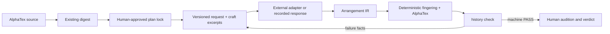

# Optional structured generation (v1)

This implements the first engineering stages of the [research report](../../deep-research-report.md):
versioned prompts and provenance, a locked Gate A plan, Arrangement IR, deterministic
compilation, gate feedback, craft retrieval, and a small generation experiment harness.
The ordinary [workflow](../workflow.md) still works without these tools.



There is no bundled model, API provider, checkpoint, training runtime, or network
retrieval. The optional adapter is a local ESM module chosen by the caller. Its
implementation may call a provider. Offline response replay exercises the same path.
No new npm dependencies or source formats are introduced: IR represents guitar
output; the piano input remains AlphaTex and alphaTab remains the parser.

## Plan and approval boundary

Write `plan.json` from this song's source map and the Gate A form/groove tables.
The [synthetic fixture plan](../../tools/fixtures/generation/plan.json) illustrates
the JSON shape; its musical choices are not defaults for real projects.

Required fields: `schemaVersion: 1`, `title`, signed `transpose`, `tuning` (MIDI,
**high string first**), `maxFret`, `style`, `gain`, `groove`, `bars`, and `sidecar`.
Every bar explicitly declares `{bar, meter: [numerator, denominator], tempo}`.
The sidecar uses the existing five modes and source/contract correspondence rules.
Each entry is a phrase-aligned chunk of at most eight bars and 32 quarter-note beats.
Entries form an ordered, contiguous partition of the plan. Every entry needs a
`note` stating its musical intent; additions must be declared `free` at Gate A.

After the human has actually approved that plan, record their decision:

```text
node tools/llm-arrange.mjs lock --plan projects/<slug>/plan.json --digest projects/<slug>/source.json --approval "<actual human Gate A decision>" --out projects/<slug>/plan.lock.json
```

Add `--policy projects/<slug>/guitar-policy.json` when a guitar policy was approved.
A melody contract resolves relative to `plan.json` through `sidecar.contract` and
is validated by the existing sidecar/contract code. Noisy sources require contract
modes for source-tied spans. Quote spans with zero melody obligations are refused.

The lock embeds the plan, source digest, contract, policy, style profile, approval text and date,
and prints a SHA-256. Record that hash with Gate A in `sessions.md`. Every generation
invocation requires that independently recorded hash as `--lock-sha256 HASH`.
Changing a mode, source bar, instrument parameter or evidence invalidates it.
The generator cannot supply modes, source correspondence or approval in its IR.
Changing an approved plan still requires the existing human PROPOSAL procedure.
Each run writes its effective configuration locally so ancestor project settings
cannot change its roles or limits. A changed shipped style profile requires review
of a new lock or restoration of the original profile.

This is an integrity and workflow boundary, **not a digital signature or proof of
identity**. A person with write access can create a new approval and lock; tools
cannot authenticate whether that person represents the human arranger.

## Generate one chunk

Record model metadata in `model.json`:

```json
{
  "provider": "<provider or external assistant>",
  "modelId": "<exact model/checkpoint identifier>",
  "modelRevision": "unrecorded",
  "tokenizerRevision": "unsupported",
  "sampling": {
    "temperature": "unrecorded",
    "topP": "unrecorded",
    "seed": "unsupported"
  }
}
```

Use exact revisions and numeric sampling settings when available. `unsupported`
means the interface cannot expose a field; `unrecorded` means it is not known.
Neither means the output is reproducible. The tools never infer a model identity
from the coding agent's name. Metadata is caller-supplied, not provider-attested.

Export an inspectable prompt for an external assistant:

```text
node tools/llm-arrange.mjs prompt --lock projects/<slug>/plan.lock.json --lock-sha256 HASH --entry 1 --model projects/<slug>/model.json --out projects/<slug>/request.json
```

The prompt contains current source bars, the whole locked form, foreground contract
and policy, approved prefix, next entry, exact IR schema and up to three craft
excerpts. `--no-retrieval` disables excerpts for an ablation. Retrieval is deterministic
lexical matching over headings in five named craft documents, with bounded excerpts;
it does not search song files, CanonRock, project histories, or the internet.

Save the assistant's IR as `chunk.json`. A replay file is an array of response
objects, each with `output` (IR object or JSON string), optional `usage` data and
optional `requestId`. Put each repair response in the next array element.
For a single response, this portable Node command wraps it:

```text
node --input-type=module -e "import fs from 'node:fs'; const output=JSON.parse(fs.readFileSync('chunk.json','utf8')); fs.writeFileSync('responses.json',JSON.stringify([{output}]))"
node tools/llm-arrange.mjs run --lock projects/<slug>/plan.lock.json --lock-sha256 HASH --entry 1 --model projects/<slug>/model.json --responses responses.json --max-repairs 0 --out projects/<slug>/generation/run-001
```

Create the `generation` parent directory first. The run directory must not exist;
it is never overwritten. Outputs stay local under the gitignored project folder.
Use `--max-repairs 0` for one recorded answer. An exhausted response array is an
operational error, not an invented model response.

For a live adapter, replace `--responses` with `--adapter path/to/adapter.mjs`.
That module exports `async generate(request, {attempt, signal})` and returns the
same response envelope. `request.model` carries the selected metadata and settings;
the adapter is responsible for applying them. It must honor the abort signal and
must not put credentials in requests, responses or usage data. Its dependencies and
provider configuration are outside this repo's runtime contract. The manifest hashes
the adapter entry file; imported adapter code and the remote provider require their
own version records.

The default is an initial attempt plus at most two repairs, matching the workflow's
three-attempt limit. Each request receives the previous compile error or complete
structured gate report. Provider/timeout/IO failures and gate exit 2 stop immediately.
No candidate is automatically shown, copied over a project cover, or approved.

## Arrangement IR and compiler scope

The authoritative machine schema is `ARRANGEMENT_IR_SCHEMA` in
[`arrangement-ir.mjs`](../../tools/lib/arrangement-ir.mjs), also included in prompts.
The strict runtime validator checks ordering, coverage and bar fill.

- Version `1.0`: one guitar, one rhythmic voice, standard six-string tuning;
  pitches are **sounding MIDI in the target key**. No implicit octave folding or
  transposition. Duplicate pitches in successive events remain distinct attacks.
- Events declare `bar`, zero-based `beat` in quarter notes, `duration`, `pitches`
  and `techniques`. `pitches: []` is an explicit rest. Gaps and overlaps are errors.
- Duration is `{value, dots, triplet?}`. Values: 1, 2, 4, 8, 16, 32 or 64;
  dots: 0, 1 or 2; `triplet: true` applies 3:2. Timing uses alphaTab's integer ticks.
  Mixed meters and approved per-bar tempos are preserved.
- Supported techniques: `palm-mute`, `vibrato`, `accent`, `staccato`.
  Ties, overlapping voices, bends, slides, harmonics, brushes/rolls, alternate
  tunings and dual guitar are explicitly unsupported by this IR version. Use the
  ordinary authoring workflow for them.
- Optional `preferredString` (1 = high E) and `preferredPosition: [low, high]`
  express soft timbral preferences. They cannot override physical constraints.
- `deliberateLosses` and `additions` are required string arrays. The human reviews
  completeness; schema validity cannot judge an explanation's honesty.

The compiler enumerates legal grips using shared geometry, rejects non-adjacent
attacks with three or more notes, and reuses the existing phrase DP. Compilation
refuses optimizer discontinuities. It does not rewrite an existing tab. Search is
bounded (48 candidates per event, existing DP beam/windows); a refusal does not
prove no possible fingering exists. Positions are recorded for timbral review.

Every candidate is parsed and checked against the locked layout, tuning, tempo,
meter, program and bar count. Undeclared pickups/navigation and chunks with zero
attacks are refused, including in raw baseline mode. IR compilation is audited against parsed pitches,
durations, attacks and effects. `tab-events` evidence is saved before the unchanged
consolidated gate runs through `history.mjs check` over the whole prefix. The gate
remains authoritative on mechanics, policies and fidelity. Compilation alone is
never a PASS.

`--format alphatex` provides the raw-output experiment. It uses the same lock and
gate, preserves the approved prefix byte for byte, and enforces the same single
track/voice boundary. Raw syntax or plan violations become repair feedback.

## Audition, history and subsequent chunks

A successful run reports `humanVerdict: PENDING` and the passing `attempt-N` directory.
Present that candidate only after PASS, using the existing Gate B template.
After the human auditions it, record their actual verdict:

```text
node tools/history.mjs verdict APPROVED --project projects/<slug>/generation/run-001/attempt-1
```

The verdict and sessions stub live with that candidate. Also record the verdict and
run path in the song's `sessions.md`. For entry 2, pass `--entry 2 --previous
projects/<slug>/generation/run-001` and a new `--out`. The tool requires a matching
passing history snapshot with an APPROVED verdict. It appends to the exact prior
AlphaTex bytes without re-optimizing approved bars. An edited or unapproved prefix
is refused. The full-prefix gate catches mechanical problems at the new seam.

Runs retain the frozen lock, runtime/code manifest, exact requests and responses,
IR and fingering, parsed events, gate reports and history snapshots. Each attempt's
`generation.json` records model settings, prompt/schema/retrieval hashes, source/
plan/prefix hashes, adapter hash, available usage/request IDs and timestamps.
History snapshots matching provenance and includes it in deduplication. A manual
edit cannot inherit stale attribution. The historical generation manifest stays
PENDING; the human verdict's authority is the history ledger, not that manifest.

Final assembly remains human-supervised. The last approved candidate contains the
complete growing tab; use it and the cumulative sidecar for the full-length gate
and audition. Keep the run directories and their per-chunk verdicts: ordinary
`history final-review` reads one history directory and does not aggregate generation
runs into a project-wide ledger.

## Evaluation and remaining research

```text
npm run test:generation
npm run benchmark:generation -- --out out/generation-benchmark
```

The frozen manifest groups splits by composition identity and records fixture hashes.
It admits only the original synthetic exercises created for this harness. Defaults
are scripted responses testing raw AlphaTex, IR, and IR plus craft retrieval. The
raw scripted response is compiler-produced, so **this is not evidence that IR beats
a model writing AlphaTex**. Reports label this `scripted-pipeline-smoke`, mark musical
quality and human minutes unmeasured, and count hard passes after 0/1/2 repairs with
explicit denominators. Gate reports and frozen source evidence remain available
for fidelity review; the report does not invent precision/recall measurements.

Pass `--adapter adapter.mjs --model model.json` for actual model experiments on the
same locked plans. Use repeated samples and a larger reviewed corpus before claiming
improvements. Blinded listening should score melody recognition, phrasing, guitar
idiom, style and physical comfort separately under identical deterministic rendering;
record human time and verdicts independently of machine validity.

The broader roadmap remains research work: expanded IR techniques, rights-cleared
approved/rejected example retrieval, preference-pair export, a large composition-
separated evaluation corpus and human study, LoRA/SFT, preference training, and
multimodal/audio critics. No model training or quality improvement is claimed here.
Repository licensing and older assets remain unresolved as recorded in
[provenance.md](provenance.md); no root license is chosen on the owner's behalf.
